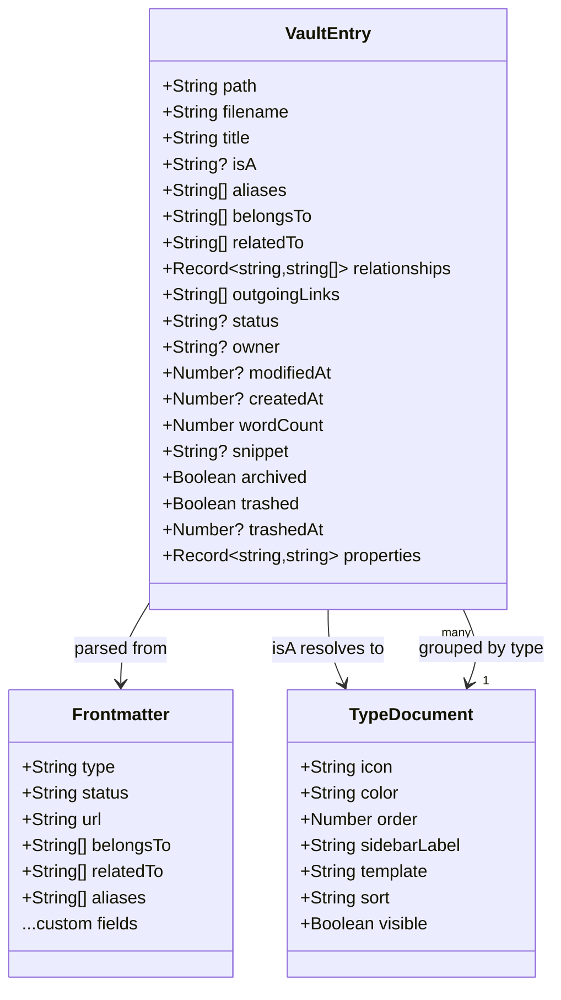
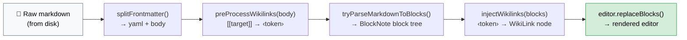
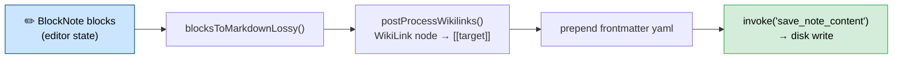

# Abstractions

Key abstractions and domain models in Laputa.

## Design Philosophy

Laputa's abstractions follow the **convention over configuration** principle: standard field names and folder structures have well-defined meanings and trigger UI behavior automatically. This makes vaults legible both to humans and to AI agents — the more a vault follows conventions, the less custom configuration an AI needs to navigate it correctly.

The full set of design principles is documented in [ARCHITECTURE.md](./ARCHITECTURE.md#design-principles).

## Semantic Field Names (conventions)

These frontmatter field names have special meaning in Laputa's UI:

| Field | Meaning | UI behavior |
|---|---|---|
| `type:` | Entity type (Project, Person, Quarter…) | Type chip in note list + sidebar grouping |
| `status:` | Lifecycle stage (active, done, blocked…) | Colored chip in note list + editor header |
| `url:` | External link | Clickable link chip in editor header |
| `date:` | Single date | Formatted date badge |
| `start_date:` + `end_date:` | Duration/timespan | Date range badge |
| `goal:` + `result:` | Progress | Progress indicator in editor header |
| `Workspace:` | Vault context filter | Global workspace filter |
| `Belongs to:` | Parent relationship | Relationship chip in Properties panel |
| `Related to:` | Lateral relationship | Relationship chip in Properties panel |

The list of default-shown relationships and semantic property rendering rules can be customized via `config/relations.md` and `config/semantic-properties.md` in the vault.

## Document Model

All data lives in markdown files with YAML frontmatter. There is no database — the filesystem is the source of truth.

### VaultEntry

The core data type representing a single note, defined in Rust (`src-tauri/src/vault/mod.rs`) and TypeScript (`src/types.ts`).



```typescript
// src/types.ts
interface VaultEntry {
  path: string              // Absolute file path
  filename: string          // Just the filename
  title: string             // From first # heading, or filename fallback
  isA: string | null        // Entity type: Project, Procedure, Person, etc. (from frontmatter `type:` field)
  aliases: string[]         // Alternative names for wikilink resolution
  belongsTo: string[]       // Parent relationships (wikilinks)
  relatedTo: string[]       // Related entity links (wikilinks)
  relationships: Record<string, string[]>  // All frontmatter fields containing wikilinks
  outgoingLinks: string[]   // All [[wikilinks]] found in note body
  status: string | null     // Active, Done, Paused, Archived, Dropped
  owner: string | null      // Person responsible
  cadence: string | null    // Update frequency: Weekly, Monthly, etc.
  modifiedAt: number | null // Unix timestamp (seconds)
  createdAt: number | null  // Unix timestamp (seconds)
  fileSize: number
  wordCount: number | null  // Body word count (excludes frontmatter)
  snippet: string | null    // First 200 chars of body
  archived: boolean         // Archived flag
  trashed: boolean          // Trashed flag
  trashedAt: number | null  // When trashed (for auto-purge)
  properties: Record<string, string>  // Scalar frontmatter fields (custom properties)
}
```

### Entity Types (isA / type)

Entity type is stored in the `type:` frontmatter field (e.g. `type: Quarter`). The legacy field name `Is A:` is still accepted as an alias for backwards compatibility but new notes use `type:`. The `VaultEntry.isA` property in TypeScript/Rust holds the resolved value.

Type is determined **purely** from the `type:` frontmatter field — it is never inferred from the file's folder location. All notes live at the vault root as flat `.md` files:

```
~/Laputa/
├── my-project.md          ← type: Project (in frontmatter)
├── weekly-review.md       ← type: Procedure
├── john-doe.md            ← type: Person
├── some-topic.md          ← type: Topic
├── ...
├── type/                  ← type definition documents
├── config/                ← meta-configuration files (agents.md, etc.)
└── theme/                 ← vault-based themes (legacy location)
```

New notes are created at the vault root: `{vault}/{slug}.md`. Changing a note's type only requires updating the `type:` field in frontmatter — the file does not move. The `type/` folder exists solely for type definition documents, and `config/` for configuration files.

A `flatten_vault` migration command is available to move existing notes from type-based subfolders to the vault root.

### Types as Files

Each entity type can have a corresponding **type document** in the `type/` folder (e.g., `type/project.md`, `type/person.md`). Type documents:

- Have `type: Type` in their frontmatter (`Is A: Type` also accepted as legacy alias)
- Define type metadata: icon, color, order, sidebar label, template, sort, view, visibility
- Are navigable entities — they appear in the sidebar under "Types" and can be opened/edited like any note
- Serve as the "definition" for their type category

**Type document properties** (read by Rust and used in the UI):

| Property | Type | Description |
|----------|------|-------------|
| `icon` | string | Phosphor icon name (kebab-case, e.g., "cooking-pot") |
| `color` | string | Accent color: red, purple, blue, green, yellow, orange |
| `order` | number | Sidebar display order (lower = higher priority) |
| `sidebar_label` | string | Custom label overriding auto-pluralization |
| `template` | string | Markdown template for new notes of this type |
| `sort` | string | Default sort: "modified:desc", "title:asc", "property:Priority:asc" |
| `view` | string | Default view mode: "all", "editor-list", "editor-only" |
| `visible` | bool | Whether type appears in sidebar (default: true) |

**Type relationship**: When any entry has an `isA` value (e.g., "Project"), the Rust backend automatically adds a `"Type"` entry to its `relationships` map pointing to `[[type/project]]`. This makes the type navigable from the Inspector panel.

**UI behavior**:
- Clicking a section group header pins the type document at the top of the NoteList if it exists
- Viewing a type document in entity view shows an "Instances" group listing all entries of that type
- The Type field in the Inspector is rendered as a clickable chip that navigates to the type document

### Frontmatter Format

Standard YAML frontmatter between `---` delimiters:

```yaml
---
title: Write Weekly Essays
is_a: Procedure
status: Active
owner: Luca Rossi
cadence: Weekly
belongs_to:
  - "[[grow-newsletter]]"
related_to:
  - "[[writing]]"
aliases:
  - Weekly Writing
---
```

Supported value types (defined in `src-tauri/src/frontmatter/yaml.rs` as `FrontmatterValue`):
- **String**: `status: Active`
- **Number**: `priority: 5`
- **Bool**: `archived: true`
- **List**: Multi-line `  - item` or inline `[item1, item2]`
- **Null**: `owner:` (empty value)

### Custom Relationships

The Rust parser scans all frontmatter keys for fields containing `[[wikilinks]]`. Any non-standard field with wikilink values is captured in the `relationships` HashMap:

```yaml
---
Topics:
  - "[[writing]]"
  - "[[productivity]]"
Key People:
  - "[[matteo-cellini]]"
---
```

Becomes: `relationships["Topics"] = ["[[writing]]", "[[productivity]]"]`

This enables arbitrary, extensible relationship types without code changes.

### Outgoing Links

All `[[wikilinks]]` in the note body (not frontmatter) are extracted by regex and stored in `outgoingLinks`. Used for backlink detection and relationship graphs.

### Title Extraction

Title comes from the first `# Heading` in the markdown body. If none is found, the filename (without `.md`) is used as fallback. Logic in `vault/parsing.rs:extract_title()`.

### Title Field (UI)

The editor displays a dedicated `TitleField` component above the BlockNote editor. This is the primary title editing surface — the H1 block inside BlockNote is hidden via CSS. Changing the title field triggers `onTitleSync`, which updates the frontmatter `title:` field and renames the file to match `slugify(title).md`. The title field also responds to `laputa:focus-editor` events with `selectTitle: true` for new note creation.

### Sidebar Selection

Navigation state is modeled as a discriminated union:

```typescript
type SidebarFilter = 'all' | 'archived' | 'trash' | 'changes' | 'pulse'

type SidebarSelection =
  | { kind: 'filter'; filter: SidebarFilter }
  | { kind: 'sectionGroup'; type: string }    // e.g. type: 'Project'
  | { kind: 'entity'; entry: VaultEntry }      // specific entity selected
  | { kind: 'topic'; entry: VaultEntry }        // topic selected
```

## File System Integration

### Vault Scanning (Rust)

`vault::scan_vault(path)` in `src-tauri/src/vault/mod.rs`:

1. Validates the path exists and is a directory
2. Scans root-level `.md` files (non-recursive)
3. Recursively scans protected folders: `type/`, `config/`, `attachments/`, `_themes/`, `theme/`
4. Files in non-protected subfolders are **not indexed** (flat vault enforcement)
5. For each `.md` file, calls `parse_md_file()`:
   - Reads content with `fs::read_to_string()`
   - Parses frontmatter with `gray_matter::Matter::<YAML>`
   - Extracts title from first `#` heading
   - Reads entity type from `type:` frontmatter field (`Is A:` accepted as legacy alias); type is never inferred from folder
   - Parses dates as ISO 8601 to Unix timestamps
   - Extracts relationships, outgoing links, custom properties, word count, snippet
6. Sorts by `modified_at` descending
7. Skips unparseable files with a warning log

A `vault_health_check` command detects stray files in non-protected subfolders and filename-title mismatches. On vault load, a migration banner offers to flatten stray files to the root via `flatten_vault`.

### Vault Caching

`vault::scan_vault_cached(path)` wraps scanning with git-based caching:

1. Reads cache from `~/.laputa/cache/<vault-hash>.json` (external to vault)
2. Compares cache version, vault path, and git HEAD commit hash
3. If cache is valid and same commit → only re-parse uncommitted changed files
4. If different commit → use `git diff` to find changed files → selective re-parse
5. If no cache → full scan
6. Writes updated cache atomically (write to `.tmp`, then rename)
7. On first run, migrates any legacy `.laputa-cache.json` from inside the vault

### Frontmatter Manipulation (Rust)

`frontmatter/ops.rs:update_frontmatter_content()` performs line-by-line YAML editing:

1. Finds the frontmatter block between `---` delimiters
2. Iterates through lines looking for the target key
3. If found: replaces the value (consuming multi-line list items if present)
4. If not found: appends the new key-value at the end
5. If no frontmatter exists: creates a new `---` block

The `with_frontmatter()` helper wraps this in a read-transform-write cycle on the actual file.

### Content Loading

- **Tauri mode**: Content loaded on-demand when a tab is opened via `invoke('get_note_content', { path })`
- **Browser mode**: All content loaded at startup from mock data
- Content for backlink detection (`allContent`) is stored in memory as `Record<string, string>`

## Git Integration

Git operations live in `src-tauri/src/git/`. All operations shell out to the `git` CLI (not libgit2).

### Data Types

```typescript
interface GitCommit {
  hash: string
  shortHash: string
  message: string
  author: string
  date: number       // Unix timestamp
}

interface ModifiedFile {
  path: string          // Absolute path
  relativePath: string  // Relative to vault root
  status: 'modified' | 'added' | 'deleted' | 'untracked' | 'renamed'
}

interface PulseCommit {
  hash: string
  shortHash: string
  message: string
  date: number
  githubUrl: string | null
  files: PulseFile[]
  added: number
  modified: number
  deleted: number
}
```

### Operations

| Module | Operation | Notes |
|--------|-----------|-------|
| `history.rs` | File history | `git log` — last 20 commits per file |
| `status.rs` | Modified files | `git status --porcelain` — filtered to `.md` |
| `status.rs` | File diff | `git diff`, fallback to `--cached`, then synthetic for untracked |
| `commit.rs` | Commit | `git add -A && git commit -m "..."` |
| `remote.rs` | Pull / Push | `git pull --rebase` / `git push` |
| `conflict.rs` | Conflict resolution | Detect conflicts, resolve with ours/theirs/manual |
| `pulse.rs` | Activity feed | `git log` with `--name-status` for file changes |

### Auto-Sync

`useAutoSync` hook handles automatic git sync:
- Configurable interval (from app settings: `auto_pull_interval_minutes`)
- Pulls on interval, pushes after commits
- Detects merge conflicts → opens `ConflictResolverModal`

### Frontend Integration

- **Modified file badges**: Orange dots in sidebar and tab bar
- **Diff view**: Toggle in breadcrumb bar → shows unified diff
- **Git history**: Shown in Inspector panel for active note
- **Commit dialog**: Triggered from sidebar or Cmd+K
- **Pulse view**: Activity feed when Pulse filter is selected

## BlockNote Customization

The editor uses [BlockNote](https://www.blocknotejs.org/) for rich text editing, with CodeMirror 6 available as a raw editing alternative.

### Custom Wikilink Inline Content

Defined in `src/components/editorSchema.tsx`:

```typescript
const WikiLink = createReactInlineContentSpec(
  {
    type: "wikilink",
    propSchema: { target: { default: "" } },
    content: "none",
  },
  { render: (props) => <span className="wikilink">...</span> }
)
```

### Markdown-to-BlockNote Pipeline



> Placeholder tokens use `\u2039` and `\u203A` to avoid colliding with markdown syntax.

### BlockNote-to-Markdown Pipeline (Save)



### Wikilink Navigation

Two navigation mechanisms:

1. **Click handler**: DOM event listener on `.editor__blocknote-container` catches clicks on `.wikilink` elements → `onNavigateWikilink(target)`.
2. **Suggestion menu**: Typing `[[` triggers `SuggestionMenuController` with filtered vault entries.

Wikilink resolution (`resolveEntry` in `src/utils/wikilink.ts`) uses multi-pass matching with global priority: filename stem (strongest) → alias → exact title → humanized title (kebab-case → words). No path-based matching — flat vault uses title/filename only. Legacy path-style targets like `[[person/alice]]` are supported by extracting the last segment.

### Raw Editor Mode

Toggle via Cmd+K → "Raw Editor" or breadcrumb bar button. Uses CodeMirror 6 (`useCodeMirror` hook) to edit the raw markdown + frontmatter directly. Changes saved via the same `save_note_content` command.

## Theme System

See [THEMING.md](./THEMING.md) for the full theme system documentation.

### Overview

Two-layer theming:
1. **Global CSS variables** (`src/index.css`): App-wide colors via `:root`, bridged to Tailwind v4
2. **Editor theme** (`src/theme.json`): BlockNote typography, flattened to CSS vars by `useEditorTheme`

### Vault-Based Themes

Themes are markdown notes in `theme/` with `type: Theme` frontmatter. Each property becomes a CSS variable with `--` prefix.

```yaml
---
type: Theme
Description: Light theme with warm, paper-like tones
background: "#FFFFFF"
foreground: "#37352F"
accent-blue: "#155DFF"
editor-font-size: 16
editor-line-height: 1.5
---
```

### ThemeManager

`useThemeManager` hook manages the theme lifecycle:

```typescript
interface ThemeManager {
  themes: ThemeFile[]
  activeThemeId: string | null
  activeTheme: ThemeFile | null
  isDark: boolean
  switchTheme(themeId: string): Promise<void>
  createTheme(name?: string): Promise<string>
  reloadThemes(): Promise<void>
  updateThemeProperty(key: string, value: string): Promise<void>
}
```

- Detects dark backgrounds via luminance calculation → sets `color-scheme` and `data-theme-mode`
- Live preview: re-applies when active theme note is saved
- Three built-in themes: Default (light), Dark (deep navy), Minimal (high contrast)
- Legacy JSON themes (`_themes/*.json`) supported for backward compatibility

### Theme Property Editor

`ThemePropertyEditor` component provides an interactive UI for editing theme properties. Uses `themeSchema.ts` to determine input types (color picker, number slider, text field) based on property names and values.

## Inspector Abstraction

The Inspector panel (`src/components/Inspector.tsx`) is composed of sub-panels:

1. **DynamicPropertiesPanel** (`src/components/DynamicPropertiesPanel.tsx`): Renders frontmatter as editable key-value pairs:
   - **Editable properties** (top): Type badge, Status pill with dropdown, boolean toggles, array tag pills, text fields. Click-to-edit interaction.
   - **Info section** (bottom, separated by border): Read-only derived metadata — Modified, Created, Words, File Size. Uses muted styling with no interaction.
   - Keys in `SKIP_KEYS` (`type`, `aliases`, `notion_id`, `workspace`, `is_a`, `Is A`) are hidden from the editable section.

2. **RelationshipsPanel**: Shows `belongs_to`, `related_to`, and all custom relationship fields as clickable wikilink chips.

3. **BacklinksPanel**: Scans `allContent` for notes that reference the current note via `[[title]]` or `[[path]]`.

4. **GitHistoryPanel**: Shows recent commits from file history with relative timestamps.

## Closed Tab History

`useClosedTabHistory` hook (`src/hooks/useClosedTabHistory.ts`) provides a LIFO stack for closed tab entries, used by `useTabManagement` to support Cmd+Shift+T reopen. Each entry stores the note's path, tab index, and full `VaultEntry`. The stack is in-memory only (resets on restart), capped at 20 entries, and deduplicates by path.

## Search & Indexing

### Search Modes

```typescript
type SearchMode = 'keyword' | 'semantic' | 'hybrid'

interface SearchResult {
  title: string
  path: string
  snippet: string
  score: number
}

interface SearchResponse {
  results: SearchResult[]
  elapsedMs: number
}
```

### Search Integration

`SearchPanel` component provides the search UI:
- Mode selector (keyword/semantic/hybrid)
- Real-time results as user types
- Click result to open note in editor
- Shows relevance score and snippet

### Indexing

Managed by `useIndexing` hook:
- Checks index status on vault load
- Two-phase indexing: scanning (parse files) → embedding (generate vectors)
- Progress streamed via Tauri events
- Incremental updates after git sync
- Metadata persisted in `.laputa-index.json`

## Vault Management

### Vault Switching

`useVaultSwitcher` hook manages multiple vaults:
- Persists vault list to `~/.config/com.laputa.app/vaults.json`
- Switching closes all tabs and resets sidebar
- Supports adding, removing, hiding/restoring vaults
- Default vault: Getting Started demo vault

### Vault Config

Per-vault settings stored in `config/ui.config.md`:
- Editable as a normal note (YAML frontmatter)
- Managed by `useVaultConfig` hook and `vaultConfigStore`
- Settings: zoom, view mode, tag colors, status colors, property display modes
- One-time migration from localStorage (`configMigration.ts`)

### Getting Started / Onboarding

`useOnboarding` hook detects first launch:
- If vault path doesn't exist → show `WelcomeScreen`
- User can create Getting Started vault or open existing folder
- Welcome state tracked in localStorage (`laputa_welcome_dismissed`)

### GitHub Integration

Device Authorization Flow for GitHub-backed vaults:
- `GitHubDeviceFlow` component handles OAuth
- `GitHubVaultModal` for cloning existing repos or creating new ones
- Token persisted in app settings for future git operations
- `SettingsPanel` shows connection status with disconnect option

## Settings

App-level settings persisted at `~/.config/com.laputa.app/settings.json`:

```typescript
interface Settings {
  anthropic_key: string | null
  openai_key: string | null
  google_key: string | null
  github_token: string | null
  github_username: string | null
  auto_pull_interval_minutes: number | null
}
```

Managed by `useSettings` hook and `SettingsPanel` component.
